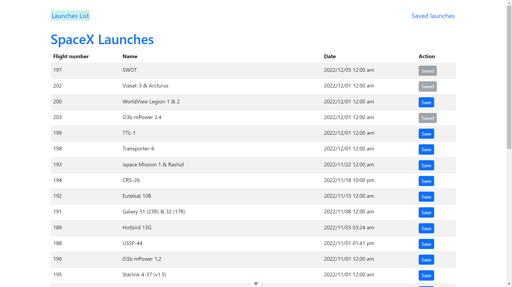
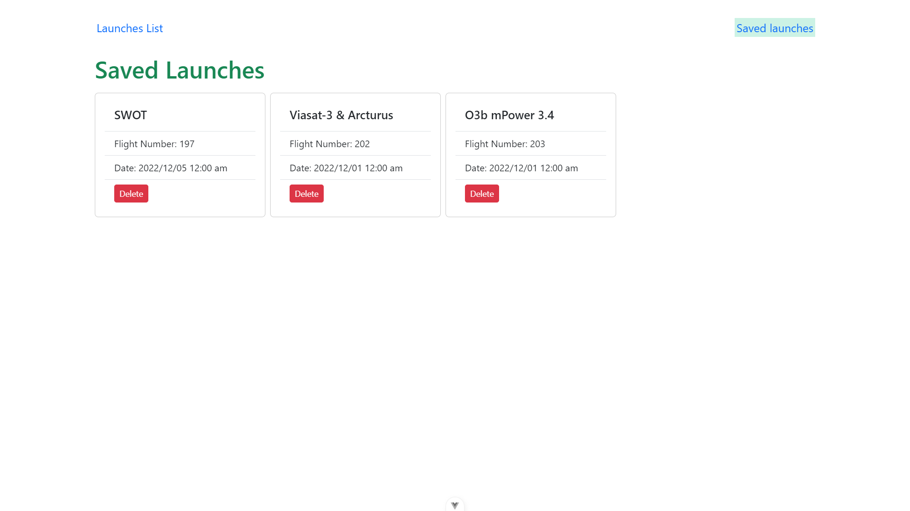

# spacex-api
Track the spacex launch details using this MEVN App

### Prerequisites
- [Nodejs](https://nodejs.org/en/download)
- [Mongodb](https://www.mongodb.com/docs/manual/administration/install-community/)

Both should be installed and make sure mongodb service is running.

### Technology stack
* Front-end
    *  Vue 3
    *  Pinia
    *  TypeScript
    *  Bootstrap 

* Back-end
    *  ExpressJS
    *  Mongoose
    *  TypeScript

## Installation Guide

```shell
git clone https://github.com/Aakash-dave/spacex-api.git

cd spacex-api
```

### Front-end

Install dependencies
```shell
cd spacex-UI

npm install
```
Start the development server
```shell
npm run dev
```

### Back-end

Install dependencies
```shell
cd service

npm install
```
Start the development server
```shell
npm start
```

### Screenshots





## Authors

- [@aakashdave](https://www.github.com/aakash-dave)


## 🚀 About Me
I'm a full stack developer...

- [Visit page](https://aakash-dave.netlify.app/)

